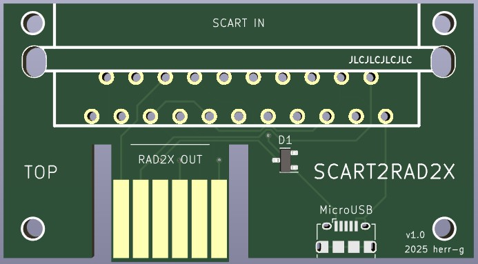

# SCART2RAD2X

This Board connects a RAD2X SNES Scaler to a universal SCART input, so you can basically run any RGB or Composite Video device to your RAD2X.
The board can be powered either over Scart Pin 8 or via Micro USB (e.g. when feeding composite video through a RCA2SCART adapter).
Both power lines lead through a double Schottky diode to avoid unwanted shorts when running both sources simultaneously.

There are four 2.5mm mounting holes.

Additional notes:
-  **Important! Make sure that your SCART device doesn't deliver a switching voltage >5V or you may harm your device.**
- Recommended PCB thickness: 1.6mm.
- **For JLCPCB**: Set the option 'Remove Order Number' to 'Specify a location' and the order number will be hidden under the SCART connector.

